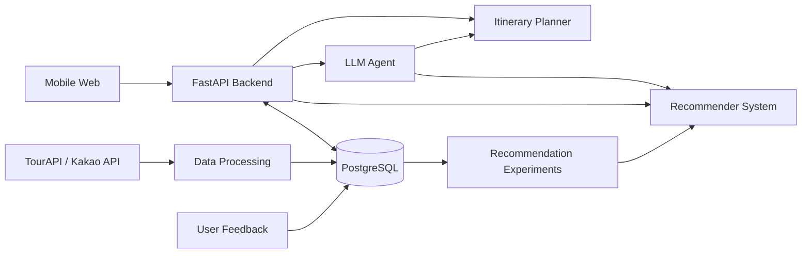

# TravelSync

**취향은 달라도 일정은 하나로: 그룹 여행 갈등 해결 플래너**  
*Different tastes, one itinerary.*

TravelSync는 친구들의 날짜, 예산, 여행 취향과 필수 조건을 모아  
**그룹 전체가 만족할 수 있는 여행 장소와 일정을 추천하는 플랫폼**입니다.

인하대학교 컴퓨터공학 종합설계 · 2026학년도 2학기  
**6조 Ourney (Our Journey)**

---

## 현재 상태

> **2026.09.30 / 6주차**

- ✅ 주제 및 서비스 범위 확정
- ✅ 전체 시스템 아키텍처 설계
- ✅ 주요 UI/UX 프로토타입 제작
- ✅ TourAPI / Kakao Local API 장소 데이터 수집 시작
- 🔄 장소 데이터 정제 및 특징(feature) 구성
- 🔄 추천 시스템 알고리즘 조사 및 비교
- ⬜ 추천 시스템 v1 구현
- ⬜ 백엔드 / DB / 프론트엔드 연동
- ⬜ LLM 일정 조율 Agent 구현
- ⬜ 통합 테스트 및 사용자 평가

**목표: 11주차까지 핵심 사용자 흐름을 시연할 수 있는 통합 데모 완성**

---

## 핵심 기능

| 기능 | 설명 |
| --- | --- |
| 여행방 | 친구 초대 및 여행 조건 관리 |
| 날짜·예산 조율 | 가능한 날짜와 예산 범위 확인 |
| 취향 입력 | 활동별 선호도 + Hard Constraint 입력 |
| 그룹 추천 | 여러 사용자의 취향을 반영한 POI 추천 |
| 일정 생성 | 추천 장소를 이용해 2–3개 일정 후보 생성 |
| 투표 | 그룹이 일정 후보를 비교하고 선택 |
| AI Agent | 채팅 요청을 이해하고 일정 변경안 제안 |
| 피드백 | 여행 후 평가를 추천 시스템 개선에 활용 |

---

## Setup (Windows PowerShell)

Use Python **3.13.14**. From the project root, create and activate a virtual environment:

```powershell
py -3.13 -m venv .venv
.\.venv\Scripts\Activate.ps1
```

Install the project dependencies:

```powershell
python -m pip install -r requirements.txt
```

Verify the installations:

```powershell
python --version
dvc --version
mlflow --version
```

To start the local MLflow server:

```powershell
mlflow server
```

---

## Recommender System

현재 추천 시스템의 **최종 알고리즘은 아직 결정하지 않았습니다.**

### 기본 구조

```text
User Preferences
       ↓
Hard Constraint Filtering
       ↓
Individual Preference Model
       ↓
Group Aggregation
       ↓
Ranking
       ↓
Top-N POIs
```

Hard Constraint는 추천 모델과 별도로 처리합니다.

예:

- 등산 불가
- 특정 활동 제외
- 예산 초과
- 이동 거리 제한

이 조건들은 다른 사용자의 높은 선호도로 상쇄되지 않습니다.

### Algorithm Decision

5주차까지는 다음 방식을 초기 설계로 사용했습니다.

```text
Content-Based Recommendation
        +
Average Without Misery
```

Average Without Misery는 특정 사용자의 만족도가 임계값보다 낮은 장소를 제거한 뒤  
나머지 사용자의 점수를 평균내는 방식입니다.

하지만 **최종 추천 시스템으로 사용하기에는 비교적 단순한 방법이라는 피드백을 받아**  
현재 더 발전된 추천 알고리즘을 조사하고 있습니다.

현재 후보:

| 후보 | 핵심 아이디어 | 상태 |
| --- | --- | --- |
| Content-Based + Group Aggregation | 사용자/POI 특징 직접 비교 | Baseline |
| Matrix Factorization / SVD | 사용자–장소 latent factor 학습 | 검토 중 |
| Autoencoder | 비선형 preference representation 학습 | 검토 중 |
| Context-Aware Recommender | 시간, 여행 상황 등 context 반영 | 검토 중 |
| Transformer | interaction sequence / context 학습 | 검토 중 |
| GNN | 사용자–POI–그룹 관계 그래프 학습 | 검토 중 |
| Reinforcement Learning | 피드백을 이용한 정책 개선 | 검토 중 |

최종 알고리즘은 다음을 비교한 뒤 팀에서 결정합니다.

- 필요한 데이터 양
- 그룹 추천 문제와의 적합성
- 구현 난이도
- 설명 가능성
- 평가 가능성
- 한 학기 내 구현 가능 여부

**Selected Algorithm: `TBD`**

> Average Without Misery는 삭제하지 않고  
> 새로운 모델과 비교하기 위한 **baseline**으로 유지할 수 있습니다.

---

## 추천 시스템 평가

추천 알고리즘 비교 시 동일한 사용자·POI 데이터에서 평가합니다.

주요 지표:

- `Precision@K`
- `NDCG@K`
- 그룹 평균 만족도
- 그룹 내 최저 만족도
- 사용자 간 만족도 차이
- Hard Constraint 위반율
- 추천 수락률 / 수정률

최종 모델은 단순히 정확도만 비교하지 않고  
**추천 품질 + 그룹 공정성 + 실제 사용성**을 함께 평가합니다.

---

## System Architecture



---

## Tech Stack

| 영역 | 기술 |
| --- | --- |
| Frontend | React, TypeScript, Vite |
| Backend | Python, FastAPI |
| Database | PostgreSQL |
| Data | pandas, TourAPI, Kakao Local API |
| Recommender | Python, NumPy, pandas, scikit-learn + TBD |
| AI Agent | OpenAI API |
| MLOps | MLflow, DVC, GitHub Actions |
| Deployment | Docker, AWS |

기술 스택은 구현 과정에서 변경될 수 있습니다.

---

## Data

POI(Point of Interest) 데이터는 현재 다음 출처를 중심으로 수집하고 있습니다.

- 한국관광공사 TourAPI
- Kakao Local API

전처리 과정에서는 각 장소를 공통 여행 취향 feature로 변환합니다.

예:

```text
Food
Cafe
Nature
History
Culture
Shopping
Activity
Entertainment
Relaxation
Festival
```

API 원본 데이터, 전처리 규칙, 추천 실험 데이터는 가능한 한 버전을 구분하여 관리합니다.

---

## Development Plan

### Now — Week 6

- 추천 알고리즘 후보 조사
- 논문 및 기존 실험 비교
- POI 데이터 전처리
- Baseline recommender 구현

### Next

- 최종 추천 알고리즘 선택
- 그룹 추천 구현
- Backend / DB / UI 연결
- 일정 생성 및 투표 기능 구현
- LLM Agent 연동

### Week 10–11

- 통합 테스트
- 사용자 평가
- 추천 모델 비교 실험
- 최종 Demo

---

## Team

| 팀원 | 담당 |
| --- | --- |
| 임재훈 | Data / POI |
| 바트에르덴 | 개발 역할 진행 상황에 따라 업데이트 |
| 오리항 | AI / Recommender System |

---

## Repository

프로젝트 진행에 따라 아래 항목을 업데이트합니다.

```text
README.md        ← 프로젝트 상태
frontend/        ← Web application
backend/         ← API / Database
recommender/     ← Recommendation models
data/            ← Data processing
experiments/     ← Algorithm experiments
```

API Key와 개인정보는 repository에 commit하지 않습니다.

---

## License

프로젝트 라이선스는 추후 결정합니다.  
외부 API 및 데이터에는 각 제공처의 이용 조건이 적용됩니다.